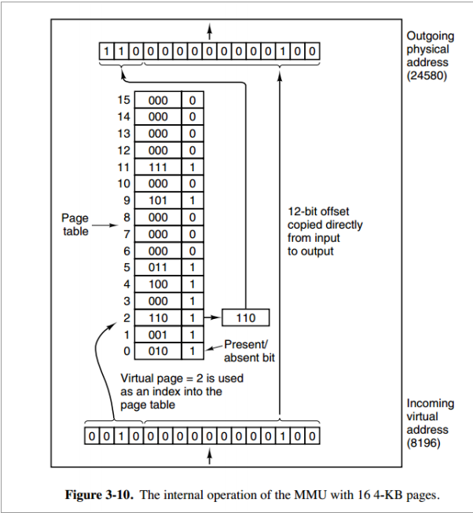

# 内存管理

### 虚拟（逻辑）内存&物理内存

* 物理内存
  * 基本单元为字节。可以视为大小为M的字节数组，是连续的。我们平常说计算机内存为16GB，则M = 16G = 2 ^ 34。
* 虚拟内存
  * 并非真实的物理内存，通常是被组织成存放于**硬盘**上的大小为N的字节数组，也是连续的（不是指硬盘上的存放是连续的），基本单元也是字节。至于N的大小，一般视程序使用的位数决定。如32位的程序，最大支持 2 ^ 32B = 4GB的虚拟内存；而64位的程序，理论虚拟内存就非常大了。

### 页

物理内存和虚拟内存都可以把内存分割成大小固定的块，称为页。物理内存叫物理页，虚拟内存叫虚拟页。通常这两种页的大小都是一样的字节。

对于虚拟内存而言，页的状态可以分为3类：

* 未分配的：即仍未映射到硬盘上。可以理解为是一种纯理论的数值，并不占用任何硬盘和内存空间。
* 缓存的：已分配的页，且缓存到了物理内存。即虚拟页映射到了物理页。
* 未缓存的：已分配的页，没有缓存到物理内存。即物理页中没有对应的虚拟页。

### 页表

每个进程都会维护一个独立的页表。因为进程必须获得物理内存才能运行（虚拟内存没用），而一般操作系统中采用的是虚拟地址而不是真实的物理地址，所以需要通过页表建立一个虚拟页到物理页的映射，从而将虚拟地址转化为物理地址。

页表是一个页表条目（PTE）的数组。它的大小一般为虚拟页的页数（不管虚拟页是否分配）。

每个PTE由一个有效位和一个地址字段组成。

* 有效位为1，表示该虚拟页是缓存的，所以地址字段就对应相应物理页的起始位置。
* 有效位为0，如果地址字段为null，表示该虚拟页未分配；否则，表示未缓存，则地址字段对应的是硬盘上的起始位置。

### 地址转换

操作系统通过CPU中的内存管理单元（MMU）和页表实现地址的转换。具体流程如下图所示：

首先，不管是物理地址还是虚拟地址，其都是由两部分组成的，即前半段页编号 + 后半段偏移。至于是如何分割的，与页的大小有关。这里物理页和虚拟页都是4KB，即2 ^ 12，则偏移为地址的低12位。

对于一个具体的虚拟地址，如8196，首先我们得到它虚拟页的编号：= (虚拟地址 - 偏移) / 页的大小，这里就是(8196 - 4) / 4096 = 2。虚拟页编号即对应页表中对应的下标，所以在页表中找下标为2的PTE。

找到后，发现有效位为1，命中。然后提取里面的地址。上图中存储的实际上是物理页的编号而不是物理页的起始地址，和前文略有出入。不过没关系，编号 * 页的大小 = 页的起始位置，这个公式对物理页和虚拟页都适用。

起始地址 + 偏移就可以得到最终的物理地址。这里计算方式为 6 * 4096 + 4 = 24580。

### 缺页

如果页表中虚拟页是缓存的，即有效位为1，则视为页命中。如果是未缓存的，则为缺页。（如果是未分配的，可以先分配，然后归为未缓存的情况）

缺页会引发缺页异常，操作系统会首先考虑物理内存中是否还有空闲的页（即未被缓存占用的），如果有，则安排空闲页供该虚拟页缓存；如果没有，需要牺牲掉一个缓存页以腾出空间。具体的选择策略参考页面置换算法。

决定牺牲掉哪个缓存页后，首先会将该页对应物理页的数据复制回虚拟页（即内存->硬盘），同时更新对应PTE。然后对于新的未缓存页，分配该物理页，将虚拟页数据复制给物理页（硬盘->内存），同时更新对应PTE。

如果简单概括的话，就是缓存页（内存）数据和未缓存页（硬盘）数据的一次交换。经过交换后，原来未缓存页变为缓存的，可以实现页命中。